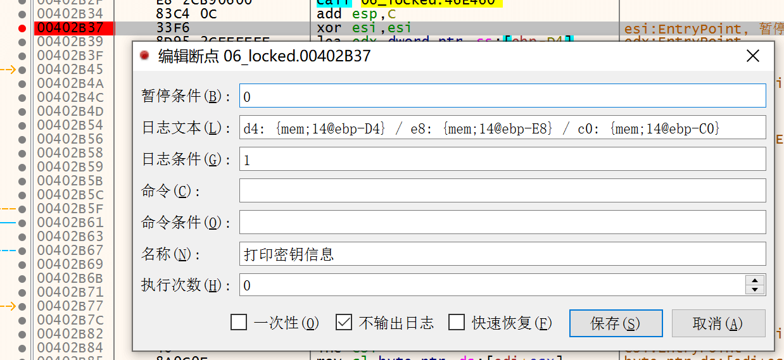
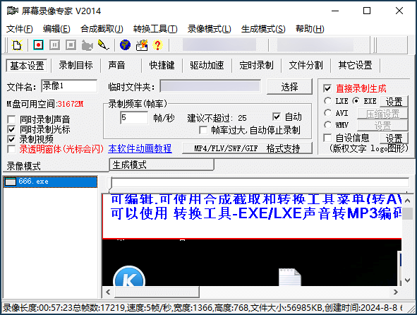

+++
date = '2024-08-08T00:00:00+09:00'
lastmod = '2025-05-12T00:00:00+09:00'
title = '解除《屏幕录像专家》播放器的“编辑加密”限制'
description = '逆向分析并解除编辑锁定限制。'
summary = '从 EXE 格式的视频文件开始，分析《屏幕录像专家》的编辑锁定实现，并解除设置。'
+++

## 前言

想着将论坛 2015 年录制的入门教程翻录到更方便、通用的 MP4 格式，方便观赏。

在网上晃了一圈发现也有其它人翻录，或做了音频降噪处理；不过没变的是右上角的文字水印和时间戳。

因为设置了“编辑加密”锁定，因此无法直接通过屏幕录像专家主程序来去除这些文字再导出，就试着解除这个锁定。

解锁前后的状态：


（当然也可以直接去掉水印然后翻录，最终的效果和文件大小都大差不差）

## 题外话

### 为什么要解除“编辑加密”锁定

为了生成便携影音格式。EXE 播放器已经不是主流，从现在来看也有很多缺点：

- 不能跨平台播放（虽然看他官网有个适配安卓的播放器）
- 无法倍速播放（只能 2 倍速，且倍速播放无音频）
- 无法透过浏览器播放 / 上传到在线流媒体平台
- 只能进行简单的后期编辑。

### 《屏幕录像专家》免费平替

目前更好用的免费、开源替代是 [OBS](https://obsproject.com/)。

除非有特殊需求，OBS 应为录制教程的首选。

## 准备工作

逆向的时候用到了这些工具，不过文章并没有详细解释工具的用法，需要读者自行摸索：

- [x64dbg 调试器](https://github.com/x64dbg/x64dbg/releases/latest)
- [IDA Pro](https://hex-rays.com/ida-pro) - 静态逆向分析
- [IDR (Interactive Delphi Reconstructor)](https://github.com/crypto2011/IDR/releases/latest) - Delphi 逆向分析辅助程序
  - ※ IDA 9.0 开始内置了大量的 Delphi 函数识别，可选。
- 十六进制编辑器
  - [ImHex](https://imhex.werwolv.net/)
  - [HxD](https://mh-nexus.de/en/downloads.php?product=HxD20)
  - [010Editor](https://www.sweetscape.com/010editor/)（收费）
- 文件对比工具
  - [WinMerge](https://github.com/WinMerge/winmerge/releases/latest)
  - [Beyond Compare](https://www.scootersoftware.com/)（收费）

※ 读者应当有一定的逆向工具使用经验。部分分析过程没有详细解释操作，而是思路。

第六课课件：

- [《吾爱破解培训第六课：潜伏在程序身边的黑影--实战给程序补丁》 讲师：我是用户](https://www.52pojie.cn/thread-405758-1-1.html)
- [百度网盘存档](https://pan.baidu.com/s/1QP5YXgIGv-e_prnB_xmcTw?pwd=scn7)（访问密码：`scn7`）
  - 包含解锁**前后**的第六课录像、通用解锁工具 v0.1.5 和对应源码。如果读者已通过其它方式下载到第六课的原件，也可以使用解锁工具进行转换来得到解锁后的文件。

同时也借助了 Hmily 提供的“编辑加密”锁定之前的原始文件用于对比参考。

## 开始逆向

准备好了吗？开始了哦！

### 内幕消息

Hmily 在我之前做了一点初步的分析，做了个 bindiff 列出二者的区别，以及关键部分的算法。

bindiff 节选：

| 地址       | 大小  | 未加密                              | “编辑加密”锁定后                    |
| :--------- | :---- | :---------------------------------- | :---------------------------------- |
| `B9C37h`   | `14h` | `96 4A FE 49 F4 3D 70 91 FE 75 ...` | `EE D6 32 34 FD 45 24 D4 48 0A ...` |
| `CC2D0h`   | `14h` | `9F C2 32 79 02 66 A0 A0 25 F7 ...` | `E7 5E DF 04 6F D6 FD 65 54 17 ...` |
| ...        |       | 都是 `14h` 或 `13h` 字节更改的情况  |                                     |
| `37A65BBh` | `2h`  | `00 00`                             | `25 3B`                             |

以及关键的解密循环：

```nasm
lb_00402B37:
  xor esi,esi                        ; 计数器
  lea edx,dword ptr ss:[ebp-D4]      ; 密钥 1
  lea eax,dword ptr ss:[ebp-E8]      ; 解密后的内容

lb_00402B45:
  mov ecx,14
  sub ecx,esi                        ; ecx = 0x14 - 计数器
  inc esi                            ; 计数器自增
  mov cl,byte ptr ss:[ebp+ecx-C0]    ; 密钥 2 (偏移 = ecx)
  xor cl,byte ptr ds:[eax]           ; xor 原文
  xor cl,byte ptr ds:[edx]           ; xor 密钥 1 内容
  inc edx
  mov byte ptr ds:[eax],cl           ; 储存结果到原文位置
  inc eax
  cmp esi,14                         ; 一共处理 0x14 字节
  jl lb_00402B45
```

（关键点让我自己来找的话，估计又要花几个小时了）

看着很复杂，但整理到高级语言后其实还行：

```c
char* edx = ptr_d4;    // ebp-D4
char* eax = ptr_e8;    // ebp-E8
char* var_c0 = ptr_c0; // ebp-C0

for (int i = 0; i < 0x14; i++) {
  eax[i] = eax[i] ^ edx[i] ^ var_c0[0x14 - i];
}
```

（注意代码会跳过 `C0[0]` 的值，这不是文章的错误，而是播放器代码如此）

解密算法得到了，现在还差两项内容：

- 密钥如何得到？
- 帧储存在哪里？如何定位修改点？

### 密钥来源

首先想办法搞明白密钥从哪来。

稍微看看之前的代码，可以发现它会检查大小是否超过 `10240`。如果未超过则不进行解密处理。

在检查长度之后的地方，用 x64dbg 设置条件断点，使其在即将解密的时候打印各项目的值：



文字形式的参数如下：

```text
断点地址    00402B37
暂停条件    0
日志文本    d4: {mem;14@ebp-D4} / e8: {mem;14@ebp-E8} / c0: {mem;14@ebp-C0}
日志条件    1
```

然后跑起来，看看日志：

```text
第一段:
  d4: 789CCC7D09785445B67FF592A43B6B771242BA89  <- 密钥 1
  e8: EED63234FD4524D4480A123172B49AEC502F043C  <- 密文 (解密后覆盖为明文)
  c0: 3135313431000000000000000000000000000000  <- 密钥 2

第二段:
  d4: 789CED7D6DB05DC571E0E87EDF77DF7B7A12421F
  e8: E75EDF046FD6FD6554178A85727A8EA42F5F3B8B
  c0: 3135313431000000000000000000000000000000

第三段：
  d4: 789CED7D59CC65D955DEAE3BFF53D5DF735563D3
  e8: 605CF1EF4359370F9196881782A75BD2A6634043
  c0: 3135313431000000000000000000000000000000
```

观察上述数据：

- `ebp-D4` 的内容每次都不一样，但是开头都是 `78 9C`，可以在原文件找到。
- `ebp-E8` 就是加密后改变的 `0x14` 长度内容，可以在原文件找到。
- `ebp-C0` 是固定值，文件内找不到（注意解密时第一个字节 `31` 不参与运算）。

此外，对 `DecompressImage_4027BC` 进行交叉检索可以得到下述可能的调用路径：

- (初始化) `_TPlayForm_FormShow` → `_TPlayForm_repareplay2(...)` → `DecompressImage_4027BC(...)`
- (播放时) `sub_403ACC` → `RenderFrame_405B80(PlayForm, ...)` → `DecompressImage_4027BC(...)`

#### 文件密钥 (`ebp-C0`)

`ebp-C0` 处的文件密钥每个文件都不一致，储存在 `[_PlayForm]+338` 处。

```c
// nonce = [[_PlayForm]+338]
memset(nonce_key, 0, 21u);
sprintf(nonce_key, "%d", nonce); // nonce = 15141, 0x3b25
```

#### 另两个密钥

在文件进行查找，可以发现 `ebp-D4` 处的内容是个“长度前缀编码”的数据 (Length-Prefixed Encoding[^lpe], 简称 LPE)：

[str_lpe]: https://en.wikipedia.org/wiki/String_(computer_science)#Length-prefixed
[^lpe]: 百科虽然没有具体的词条，但是在介绍[字符串编码][str_lpe]这里有提到；原理是通用的。

```text
         |  00 01 02 03 04 05 06 07  08 09 0A 0B 0C 0D 0E 0F | 说明
---------+---------------------------------------------------+
         |                                                   |
00A:B1B0 |                           F6 D4 01 00 84 A9 05 00 | 帧头
00A:B1C0 |  78 9C CC 7D 09 78 54 45  B6 7F F5 92 A4 3B 6B 77 | 起始数据
00A:B1D0 |  12 42 BA 89                                      |
         |                                                   |
---------+---------------------------------------------------+
         |                                                   |
00B:9C30 |                       EE  D6 32 34 FD 45 24 D4 48 |
00B:9C40 |  0A 12 31 72 B4 9A EC 50  2F 04 3C                |
         |                                                   |
---------+---------------------------------------------------+
         |                                                   |
00C:86B0 |        00 00 00 00 61 03  00 00 CC 01 00 00 00 00 | 帧后面的内容
00C:86C0 |  00 00 FF FF FF FF 5B 03  00 00 C5 01 00 00 00 00 |
00C:86D0 |  00 00 02 00 00 00 39 02  00 00 9D 00 00 00 3A 02 |
         |                                                   |
---------+---------------------------------------------------+
```

其中：

- `F6 D4 01 00`: 表示后续数据的长度为 `0x0001d4f6`。
  - 下一节数据在 `0x00AB1B8 + 0x0001d4f6`，也就是偏移 `0x00C86B2` 处；
- `84 A9 05 00`: 表示解压后的数据长度（猜测）。
- `ebp-E8` 指向的内容刚好在数据中间
  - 算法为 `0xAB1C0 - 4 + (0x1d4f6 / 2)`，也就是 `0xb9c37` 处。

不过这个帧与帧之间又有一些“意义不明的数据”，需要结合代码分析。

### 帧储存格式

帧与帧之间有很多意义不明的数据，需要想办法知道它的计算规则（或如何正确的跳过这些内容）。

回溯调用方，找到播放时执行的 `RenderFrame_405B80` 方法，再想办法找点“小”的帧数据来看：

```text
--- 第一帧的数据
decompress_enter: pos=CFAF4; exp_len=(49)
decompress_done: pos=CFB3D

49 00 00 00    A2 00 00 00  // 帧头
78 9C 73 ... 66 0F 8D       // 数据

// 偏移: CFB3D
D3 FF FF FF // 负数，帧结束标志。
F5 01 00 00 | D0 00 00 00 // 意义不明，两个 f32 浮点数

// 新的“帧”开始：
00 00 00 00 // 另一个 LPE，空的

2E 00 00 00 // 帧开始标识符（负数表示没有更新或结束）
25 05 00 00|7D 02 00 00|31 05 00 00|89 02 00 00 // 坐标

--- 第二帧的数据
// 偏移: CFB61
98 00 00 00 // compressed size

decompress_enter: pos=CFB65; exp_len=(98)
decompress_done: pos=CFBFD
```

整理下逻辑，这就是跨越了 2 “帧”（实际上是帧引用的图像）的数据。

结合实际猜测，大概是这样的结构：

```c
struct frame_data {
    uint32_t compressed_size;
    uint32_t decompressed_size;
    uint8_t compressed_data[compressed_size - 4];
};

// 连续的 `other_frame` 结构体。
struct other_frame {
    // 未知数据流
    uint32_t stream2_len;
    uint8_t stream2[stream2_len];
    
    uint32_t frame_id; // 帧序号
    if (frame_id > 0) { // 负数表示无数据，例如屏幕无更新内容
        RECT patch_cord; // 应该是坐标
        
        while (frame_id > 0) {
            struct frame_data frame; // 帧信息
            uint32_t frame_id; // 帧序号
        }
    }
    
    // field_24 == 1 的情况，会有两个额外的 f32 数据。
    if (field_24 == 1) {
        float unknown_1;
        float unknown_2;
    }
};
```

毕竟是个播放器，合理怀疑 `stream2` 储存的数据其实是用于辅助定位上一个“完整帧”的信息或鼠标指针数据。
不过看起来和“编辑加密”的锁定无关，就没继续跟进了。

大概分析清楚“帧”储存的格式后，就可以尝试定位数据的起始位置。

### 帧开始的地方

首先对 `_PlayForm` 地址下写入断点，看它如何赋值（EXE 自带符号，x64dbg 直接输入即可）。

断在 `004965A4`，发现是实例化新类的代码中间：

```nasm
loc_00439944:
  mov dword ptr ds:[eax],ebx
```

回溯一下：

```nasm
lb_00401341:
  mov ecx,dword ptr ds:[4961C8]
  mov eax,dword ptr ds:[ecx]
  mov ecx,dword ptr ds:[<&_PlayForm>]
  mov edx,dword ptr ds:[48E980]
  call 0x0043992C                       ; 调用实例化方法

lb_0040135A: 
  mov eax,dword ptr ds:[4961C8]         ; 执行到此处时，[_PlayForm]+338 的初始化已完成
```

等 CALL 结束后已经太迟了，因此在 `004965A4` 赋值之后对 `[_PlayForm]+338` 下硬件写入断点。

继续运行，断在此处：

```nasm
lb_004089E5:
  mov dword ptr ds:[ebx+338],edx
  jmp 0x00408A51
```

放到 IDA 里一看，发现在 `_TPlayForm_FormCreate` 函数内。

然后快速过一遍这个函数，发现该函数进行了基本的初始化。例如从文件末尾读入 `0x2c` 字节：

```text
         |  00 01 02 03 04 05 06 07  08 09 0A 0B 0C 0D 0E 0F |       ASCII      |
---------+---------------------------------------------------+------------------|
37A:65BB |  25 3B 00 00 00 00 00 00  00 00 00 00 00 00 00 00 | %;.............. |
37A:65CB |  00 00 00 00 08 00 00 00  08 00 00 00 0A AE 0A 00 | ................ |
37A:65DB |  70 6D 6C 78 7A 6A 74 6C  78 00 00 00             | pmlxzjtlx...     |
---------+---------------------------------------------------+------------------|
```

简单分析下这段数据：

- `0x00` 处就是“文件密钥”了，我认为它是“每个文件都有的一个随机值”，称之为 `nonce`；
  - 未锁定的时候这里是 `0`。
- `0x1c` 处为 `0A AE 0A 00`，小端序读取是 `0xaae0a`。这是数据起始的位置；
- `0x20` 处是用于判定文件是否为“屏幕录像专家生成的录像文件”特征码 (magic number)。
- 其他内容不明。

部分窗体的数据稍后在 `_TPlayForm_repareplay1` 读取，从文件的 `-0xE0` 到 `-0xE0 + 0xB4`：

```text
37A:6507  00 00 00 00 01 00 00 00 01 00 00 00 00 00 00 00  ................ 
37A:6517  00 00 00 00 00 00 00 00 00 00 00 00 01 00 00 00  ................ 
37A:6527  01 00 00 00 01 00 00 00 01 00 00 00 01 00 00 00  ................ 
37A:6537  01 00 00 00 01 00 00 00 CE E1 B0 AE C6 C6 BD E2  ........吾爱破解  <-- GBK 编码
37A:6547  C5 E0 D1 B5 B5 DA C1 F9 BF CE 00 00 00 00 00 00  培训第六课......      窗体标题
37A:6557  03 00 00 00 02 00 00 00 01 00 00 00 01 00 00 00  ................ 
37A:6567  01 00 00 00 00 00 00 00 00 00 00 00 00 00 00 00  ................ 
37A:6577  00 00 00 00 00 00 00 00 00 00 00 00 00 00 00 00  ................ 
37A:6587  00 00 00 00 00 00 00 00 00 00 00 00 00 00 00 00  ................ 
37A:6597  00 00 00 00 00 00 00 00 00 00 00 00 00 00 00 00  ................ 
37A:65A7  00 00 00 00 00 00 00 00 00 00 00 00 00 00 00 00  ................ 
37A:65B7  00 00 00 00                                      ....
```

是窗体的一些配置信息，和我们研究的内容没啥关系。

到这里就没有明显的线索继续了，`_TPlayForm_FormCreate` 函数就此结束。

不过别急，还记得之前查找的 `DecompressImage_4027BC` 调用链吗？

- `_TPlayForm_FormShow` → `_TPlayForm_repareplay2(...)` → `DecompressImage_4027BC(...)`

我们现在位于 `_TPlayForm_repareplay1` 函数，进行了第一段初始化；
那么合理猜测，`_TPlayForm_repareplay2` 函数有第二部分的初始化代码。

猜测下初始化的流程：

- 初始化播放器主窗口
  - 触发事件 `FormCreate`，调用 `_TPlayForm_repareplay1` 进行第一阶段的初始化。
  - 触发事件 `FormShow`，调用 `_TPlayForm_repareplay2` 进行后续部分的初始化。

抵达 `_TPlayForm_repareplay2` 后，记得尝试补充下结构体来优化阅读体验，大概补充出“文件流”和它 `VTable` 里的部分方法名就好，不需要处理得很完美：

```c
// 像这样：
this->file_stream->vt->read(this->file_stream, &temp_u32, 4);
DecompressImage(this, this->bitmap2, this->file_stream, temp_u32, ...);
```

将整个函数代码复制下来，重点观察 `file_stream` 是如何读取数据的：

```c
// 在屏幕录像专家 V2014 和 V2023 版本生成的文件中，
//   off_reader 的值等价于之前找到的 “0xaae0a + 4” 的结果。
this->file_stream->vt->seek(this->file_stream, off_reader, SEEK_SET); 

// 读入 40 字节数据。这里面有重要的东西，需要记录下来备用。
this->file_stream->vt->read(this->file_stream, &this->field_14D8, 40);


// 此处跳过一堆意义不明的数据读取过程，都是固定长度的数据，因此不需要花费太多时间分析。


// 不清楚这个 flag 的含义，解密的时候照抄就好。
if (this->field_14D8.field_24 == 1) {
  // 读入两个 f32 浮点数
  this->file_stream->vt->read(this->file_stream, &temp_u32, 4);
  this->file_stream->vt->read(this->file_stream, &temp_u32, 4);

  // LPE 数据，意义不明
  this->file_stream->vt->read(this->file_stream, &temp_u32, 4);
  TStream_CopyFrom((TStream *)this->stream2, this->file_stream, temp_u32);
}

// 开始解密第一帧数据了
this->file_stream->vt->read(this->file_stream, &temp_u32, 4);
DecompressImage(this, this->bitmap2, this->file_stream, temp_u32, ...);
```

其中 `field_14D8` 有很多成员意义不明，有用的就这个 `field_24` 和代表帧数量的 `field_C`。

中间这些意义不明的数据不需要管它，只要知道如何抵达第一帧的位置即可：

```c
0xaae0a /* 初始偏移 */ + 4 /* audio_offset */ 
  + 40 /* field_14D8 */
  + 20 + 20 + 40 + 4 + 4 + 4 + 20 + 4 + 1 + 1 + 1 + 1 /* 无关数据 */
  + /* field_14D8.field_24 == 1 */(4 + 4 + 4 /* stream2 长度 */ + 0x2FE /* stream2 */)
= 0xab1b8
```

在编辑器验证一下找到的地址：

```text
00A:B1B0                          F6 D4 01 00|84 A9 05 00
00A:B1C0  78 9C CC 7D 09 78 54 45 B6 7F F5 92 A4 3B 6B 77
```

成功抵达第一帧的位置。

## 修复

算法和定位帧数据的逻辑都找到了，简单写个工具枚举全部帧然后打补丁就好。

补丁完后记得将结尾的 `nonce` 清零，去除锁定状态。

当然，我也做了个简单的解锁工具。源码和编译好的二进制文件都可以在 [GitHub](https://github.com/FlyingRainyCats/pmlxzj_unlocker) 找到。

使用方法很简单，起一个终端，然后执行：

```pwsh
.\pmlxzj_unlocker.exe unlock "吾爱破解培训第六课：潜伏在程序身边的黑影--实战给程序补丁.exe" "666.exe"
```

（XP 或 32 位系统应使用 `pmlxzj_unlocker_i686.exe`；XP 下中文显示会乱码）

把解锁后的文件放到屏幕录像专家里看看：



非常完美！可以修改设定然后转换格式。

※ 工具使用说明可以参考项目的 [`README.MD` 说明文件][unlocker_readme]（或使用记事本打开压缩包中的同名文件）。

[unlocker_readme]: https://github.com/FlyingRainyCats/pmlxzj_unlocker/blob/main/README.MD

## 结语/碎碎念

算法不是特别复杂，主要是“面向对象”的各种虚表调用看起来头大。

研究这算法比我用 OBS 连续翻录两次完整教程的时间还长。

OBS 永远的神，屏幕录像专家可以说是时代的眼泪了…

一开始也想过所谓的“高度无损压缩”会是什么黑科技，结果却发现就是简单的 zlib 压缩有点失望。

解锁工具顺便做了解锁“播放加密”文件的支持（需要提供原始密码）。不过，如果原始密码只有一位，可以添加 `-r` 来绕过（偷偷说一声，第一位密码不参与数据解密的）。

P.S.: 屏幕录像专家还有安卓版可以播放 exe 视频，代码在它的 `so` 库内，也保留有一定的符号信息。

## 项目信息

屏幕录像专家解锁工具：

- [GitHub: FlyingRainyCats/pmlxzj_unlocker](https://github.com/FlyingRainyCats/pmlxzj_unlocker)
  - [下载最新版](https://github.com/FlyingRainyCats/pmlxzj_unlocker/releases/latest)

### 更新记录

- v0.1.8 - 2025.01.18
  - 新指令：消除文字水印
    - “屏幕录像专家 未注册” 字样。
    - 用户指定的文字字样。
  - 修正：禁用音频流支持旧版本的播放器数据格式。
- v0.1.7 - 2024.08.18
  - 支持《屏幕录像专家 V2023》生成的 AAC 音频格式。
  - 修正了调试版本和 Linux 版本的构建问题。
- v0.1.6 - 2024.08.15
  - 声音提取
    - 支持 “不压缩 (WAV)” 格式
    - 支持 “有损压缩 (MP3)” 格式
  - 新增：禁用音频
    - 《屏幕录像专家》不允许转码使用了 “有损压缩 (MP3)” 压缩方式的 EXE 视频。使用该功能禁用后可以生成无音频的 MP4 视频文件。
- v0.1.5 - 2024.08.08
  - 支持解锁播放密码保护的文件
  - 支持更古老版本（<= 7.0）录制的 EXE 播放器数据（即音频数据在前，视频数据在后的情况；如「ximo 脱壳基础」）。
- v0.1.4 - 2024.08.06
  - 使用 msys2 构建，提供 MinGW32 (-i686 后缀) 与 UCRT64 构建。
  - MinGW32 构建支持 XP，但中文字符乱码。
- v0.1.3 - 2024.08.04
  - 修正上个版本的 `usage` 错字。
- v0.1.0-0.1.2 - 2024.08.04（未发布）
  - 修正了无音频 EXE 播放器的支持。
  - 重构/修正帧信息枚举逻辑。

## 其它

本文也发表至以下位置：

- [解除《屏幕录像专家》EXE 播放器的 “编辑加密” 锁定 - 吾爱破解](https://www.52pojie.cn/thread-1952469-1-1.html)
