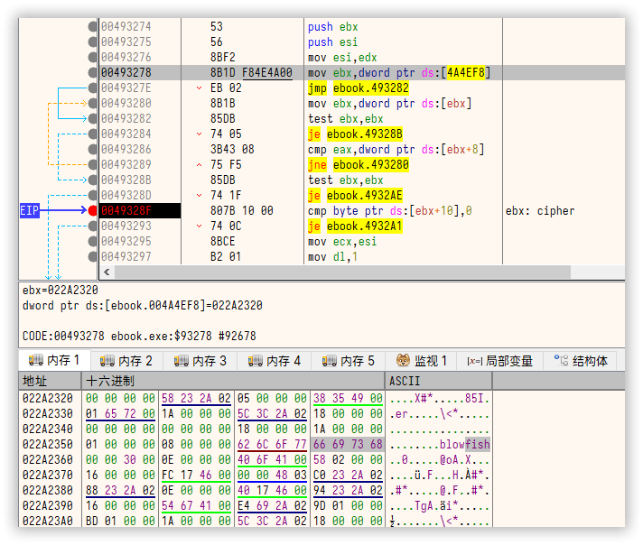

+++
date = '2025-05-11T09:39:02+09:00'
lastmod = '2025-05-11T22:29:02+09:00'
title = '解包 AGE Flash Packer 生成的可执行文件'
description = '透过逆向分析 AGE Flash Packer 生成的可执行文件，最终编写一个资源提取工具。'
summary = '逆向分析 AGE Flash Packer 生成的文件并提取资源。'
+++

## 前因

起因是在论坛收到一则求助：

> 求助关于雅致Flash播放器(AGE FlashPacker)的数据解密问题  
> (出处: [吾爱破解论坛](https://www.52pojie.cn/thread-2030470-1-1.html))

文中给出了一个样本文件：

- [蓝奏网盘](https://wwio.lanzoub.com/iPVRq2vvpedc)
- [百度网盘](https://pan.baidu.com/s/1kI9o5n8ARTx2--OXTreJnw?pwd=52pj)（备份）

下面是对应的 SHA256 校验值：

```text
9d139494eba8891846a0ce961c1f3235c4eefb1d9d04018da2a585e681af7744 *ebook.exe
```

## 观察文件

先拿十六进制编辑器看看文件吧。

### 文件末尾

在文件的末尾可以看到类似这样的内容：

```yaml
文件偏移: 0x014fd711

字符串:
  长度: 0D 00 # =0x0d, 13
  内容: "untitled1.swf"

未知内容: # 未知 1
  20 03 00 00 58 02 00 00 00 00 00 00 00 01

签名信息:
  "AGE Flash Player"

未知内容:
  未知2: 11 D7 4F 01 # =0x014fd711
  未知3: 00 20 0C 00
  未知4: 80 95 2D 00
  未知5: 3E D3 4F 01 # =0x014fd33e
  未知6: 43 00 00 00 # =0x43
```

其中，未知内容块有一些看起来像是在引用文件结尾的数据。

- 「未知 2」看起来指向这段元信息开始处
- 「未知 5」看起来是某个数据的偏移

其它未知内容信息不足以判定到底在干什么，因此看看「未知 5」的内容：

```text
14F:D33E  78 01 6D 94                                      x.m”
```

这个 `78 01` 看起来就是 zlib 压缩后的数据。虽然不清楚具体数据有多大，保险起见将元数据前的内容全部一起解压看看：

```py
# 安装依赖: pip install hexdump2
from hexdump2 import hexdump
import os
import zlib

with open("ebook.exe", "rb") as f:
    f.seek(0x014FD33E, os.SEEK_SET)
    data = f.read(0x014FD711 - 0x014FD33E) # 不填这个参数读到结尾也可以
data = zlib.decompress(data)
hexdump(data)  # 或直接 print(data) 查看
```

可以看到这样的数据：

```text
00000000  81 2c 25 00 21 16 66 00  00 90 01 00 0d 00 75 6e  |.,%.!.f.......un|
00000010  74 69 74 6c 65 64 31 2e  73 77 66 a2 42 8b 00 66  |titled1.swf.B..f|
00000020  69 17 00 00 90 01 00 0e  00 73 72 63 5c 62 67 6d  |i........src\bgm|
00000030  5c 30 31 2e 6d 70 33 08  ac a2 00 42 60 19 00 00  |\01.mp3....B`...|

                            ... 省略 ...

000007d0  dc 00 00 0d 00 73 72 63  5c 69 6d 67 5c 63 2e 6a  |.....src\img\c.j|
000007e0  70 67                                             |pg|
000007e2
```

看起来像是「打包」的文件清单以及一些基本信息。

### 文件清单

这个格式相对比较简单，大概如下：

```yaml
地址:  81 2c 25 00  # =0x00252c81
未知1: 21 16 66 00  # =0x00661621
未知2: 00 90 01 00  # =0x00019000

字符串:
  长度: 0d 00 (=0x0d, 13)
  内容: "untitled1.swf"
```

后面的内容都是重复该格式直到结束。

你可能注意到上面有个未知内容，这个稍后会提到。

偏移 `0x00252c81` 处的数据大概是这样：

```text
025:2C81  05 00 00 00 96 DA 9D EE 4D F8 A8 80 B0 B6 6E B9  ....–Ú.îMø¨€°¶n¹
025:2C91  BE A4 C9 A5 05 3A 6F 2C 29 78 33 F1 9C 38 4B 0D  ¾¤É¥.:o,)x3ñœ8K.
025:2CA1  DA EB 45 0B 35 8F 27 87 80 C3 70 AA E5 F5 79 5D  ÚëE.5.'‡€Ãpªåõy]

                            ... 省略 ...

```

这个文件是 `swf` 文件，但是这附近却看不到 Flash 文件的特征（`"CWS"` 或 `"FWS"`）。文件被加密了呢。

### 解密算法？

之前的内容还能全靠猜，但如果数据加密了，光靠猜是猜不出结果的。

原帖提及了一个处理文件解密的函数入口：`00498B80`；以此为切入点，使用 IDA 分析吧。

有些 Delphi 的内置函数被 IDA 利用 [FLIRT 签名][flirt]识别出来了，反编译的代码还是相对比较好理解的。

[flirt]: https://docs.hex-rays.com/user-guide/signatures/flirt

但是注意：虚表调用/结构体缺少数据，这部分只能手动分析然后补上。

将 `00498B80` 反编译，然后稍作整理：

```cpp
using Classes::TList;

bool __fastcall ServeRequest_498B80(
  TRequest *req,
  int uri,
  TWriterStream *res
) {
  bool handled = FALSE;
  if ( uri ) {
    int index = FindFileIndexByURI(req, uri);

    // -1 表示文件不存在
    if ( index >= 0 ) {
      TFileEntry * file = (TFileEntry *)TList::Get(req->files, index);
      req->reader->vtb->Seek(req->reader, file->offset, SEEK_SET);
      if ( file->enc_size <= 0 )
        Send_498954(req, res, file->size, NULL);
      else
        DecryptSend_4989A0(req, &res, file->size, file->enc_size);
      handled = TRUE;
    }
  }
  return handled;
}
```

读者如果有写过服务器代码，会发现这里的代码与响应请求的结构非常相似。

再结合动态调试，可以发现执行 `DecryptSend_4989A0` 函数后会产生解密后的数据：

```x86asm
loc_00498BDE:
  push eax                      ; 参4: 加密大小
  lea edx,dword ptr ss:[ebp-8]  ; 参2: 响应
  mov ecx,dword ptr ds:[esi+4]  ; 参3: 大小
  mov eax,ebx                   ; 参1: 请求
  call ebook.4989A0             ; 调用函数 DecryptSend_4989A0
  jmp ebook.498BFD              ; [[ebp-0x08]+4] => 这里是解密后的数据
```

因此继续深入 `DecryptSend_4989A0` 的解密逻辑，可以发现这里又调用了一堆其它函数。

单纯静态分析调用的函数会比较困难，带着调试器跟一下数据会方便很多。

例如 `CipherFactory_493274` 是从已注册的块加密列表中找到对应的值：

```c
TCipher *__fastcall CipherFactory_493274(int cipher_id) {
  LinkCipher *cipher; // ebx

  for ( cipher = g_Ciphers_4A4EF8; cipher; cipher = cipher->next ) {
    if (cipher_id == cipher->id) {
      return cipher->methods->Create(); // Blowfish: 00493090
    }
  }
  return NULL;
}
```

在调试器跟踪的话比较容易知道有什么内容：

  
（查询代表 `0x05` 的 Blowfish 算法，可以在 `ebx+8` 处看到它的 ID）

可以发现它只注册了一个算法，也就是代表 Blowfish 的 `0x05`。

而 `CipherInit_492520` 则是初始化刚才拿到的 Blowfish 实例：

```cpp
using Classes::TComponent::TComponent;

void __fastcall CipherInit_492520(
  TCipher *cipher,
  const void *key
) {
  uint8_t digest[20]; // [esp+0h] [ebp-20h] BYREF

  if ( cipher->initialized )
    cipher->vtb->Burn(cipher);

  DCP_SHA1 *sha1 = (DCP_SHA1 *)TComponent(&cls_Sha1_TDCP_sha1);
  sha1->vtb->Init(sha1);
  SHA1::UpdateString_49321C(sha1, key);
  sha1->vtb->Final(sha1, digest);
  System::TObject::Free((System::TObject *)sha1);

  // Blowfish MaxKeySize: 448
  if ( cipher->vtb->GetMaxKeySize(cipher) >= 160 ) {
    cipher->vtb->Init(cipher, digest, 160, NULL);
  } else {
    int MaxKeySize = cipher->vtb->GetMaxKeySize(cipher);
    cipher->vtb->Init(cipher, digest, MaxKeySize, NULL);
  }

  System::__linkproc__ FillChar(digest, 20, 0xFF);
}
```

- 合理猜测 Blowfish 的密钥是 `SHA1("AGE Flash Player")`，跟踪发现确实如此。
- 产生的摘要值（digest）顺理成章的作为 Blowfish 算法的密钥进行初始化。

将类型信息整合，加上我们的注解，可以得到下方的代码：

```c
int __fastcall DecryptSend_4989A0(
  TRequest *req,
  TWriterStream **res,
  int full_len,
  int enc_len
) {
  TFileHeader hdr; // size=12
  BufferRead_41B1D8(req->reader, &hdr, sizeof(hdr));

  // 初始化解密过程
  TCipher *cipher = CipherFactory_493274(hdr.magic);
  CipherInit_492520(cipher, AnsiString("AGE_Flash_Player"));

  // 如果是块加密算法，设置为 CFB 模式。
  if ( IsClass(cipher, &cls_DCPcrypt_TDCP_blockcipher) ){
    cipher->CipherMode = BLOCK_MODE_CFB_BLOCK;
  }

  // 测试解密，不相等就报错。
  cipher->vtb->decrypt(cipher, &hdr.cipher, &hdr.cipher, 12);
  if ( hdr.cipher != hdr.plain ) {
    RaiseExcept(ExceptionFactory(error_ctx)); // 抛出错误
  }

  // 解密文件头
  DecryptStream_4925C0(cipher, req->reader, *res, enc_len);

  // 如果还有数据，将剩下的数据拷贝过去
  if ( enc_len < full_len - 12 ) {
    Send_498954(req, *res, full_len - 12 - enc_len, NULL);
  }

  // 清理并释放资源
  cipher->vtb->Burn(cipher);
  System::TObject::Free(cipher);

  return NULL;
}
```

看起来并没有什么魔改的地方，剩下的就很简单了… 对吧？

### DCPcrypt

> DCPcrypt 这么成熟的库，与其它语言的实现一定能兼容的对吧？对吧？？

可执行文件内置了一些符号，可以看出程序中的 `SHA1` 和 `Blowfish` 实现来自 [DCPcrypt]。

虽然对算法本身的实现（即 ECB 模式）是标准的，但当数据长度未与块大小对齐的情况下…

```pas {linenos=inline, hl_lines=["22-27"]}
procedure TDCP_blockcipher64.DecryptCFBblock(const Indata; var Outdata; Size: longword);
var
  i: longword;
  p1, p2: PByte;
  Temp: array[0..7] of byte;
begin
  if not fInitialized then
    raise EDCP_blockcipher.Create('Cipher not initialized');
  p1:= @Indata;
  p2:= @Outdata;
  FillChar(Temp, SizeOf(Temp), 0);
  for i:= 1 to (Size div 8) do
  begin
    Move(p1^,Temp,8);
    EncryptECB(CV,CV);
    Move(p1^,p2^,8);
    XorBlock(p2^,CV,8);
    Move(Temp,CV,8);
    p1:= PByte(PByte(p1) + 8);
    p2:= PByte(PByte(p2) + 8);
  end;
  if (Size mod 8)<> 0 then
  begin
    EncryptECB(CV,CV);
    Move(p1^,p2^,Size mod 8);
    XorBlock(p2^,CV,Size mod 8);
  end;
end;
```

（来源：[SnakeDoctor/DCPcrypt: `DCPblockciphers.pas`][dcp_cfb]；正确做法是使用 `pkcs#1` 等填充方案）

[dcp_cfb]: https://github.com/SnakeDoctor/DCPcrypt/blob/f319817/DCPblockciphers.pas#L319

因此如果需要使用其它语言实现，那么需要利用 `ECB` 模式，来手动实现 DCPcrypt 版的 `CFB` 模式。

> DCPcrypt 的 IV 生成部分也是非标行为。
>
> 有兴趣的同学可以自行尝试逆向（或[瞄一眼我的实现][dcp_iv_init]），这里就不展开了。

[DCPcrypt]: https://wiki.lazarus.freepascal.org/DCPcrypt
[dcp_iv_init]: https://github.com/FlyingRainyCats/age_unpack/blob/8fb72d1/age/cipher.py#L14

## 解密流程

> 需要的信息都有了，总结一下流程。

首先是「读取可执行文件信息」，也就是文件末尾的 20 个字节：

```yaml
末尾数据:
  元数据偏移: u32 # 例 0x014fd711
  未知3:      u32
  未知4:      u32
  清单偏移:   u32 # 例 0x014fd33e
  未知6:      u32
```

然后就是文件清单。

- 读取「清单偏移」与「元数据偏移」之间的数据
- 使用 `zlib.decompress` 解压缩

文件清单的格式如下：

```yaml
数据偏移: u32
完整长度: u32
加密长度: u32

文件名:
  长度: u16
  内容: Vec<u8> # 文件名长度为 "$.文件名.长度"
```

剩下的就是依次进行提取了：

- 跳到指定数据偏移处
- 读入加密数据长度的内容
  - 初始化 Blowfish 算法，并进行解密
- 读入「完整长度 - 加密长度 - 12」字节的数据
  - 这部分数据不需要解密，直接写出即可

到此，提取流程就完成了。

## 参考实现

使用 Python 做了个简单的实现，大概只支持某一个版本的 AGE 打包器生成的文件。

⇒ [github.com/FlyingRainyCats/age_unpack](https://github.com/FlyingRainyCats/age_unpack)

※ 上述解包项目使用 [MIT 授权协议](https://github.com/FlyingRainyCats/age_unpack/blob/main/LICENSE)。

## 其它

本文也发表至以下位置：

- [解包《雅致 Flash打包器 (AGE Flash Packer)》生成的可执行文件 - 吾爱破解](https://www.52pojie.cn/thread-2030676-1-1.html)
